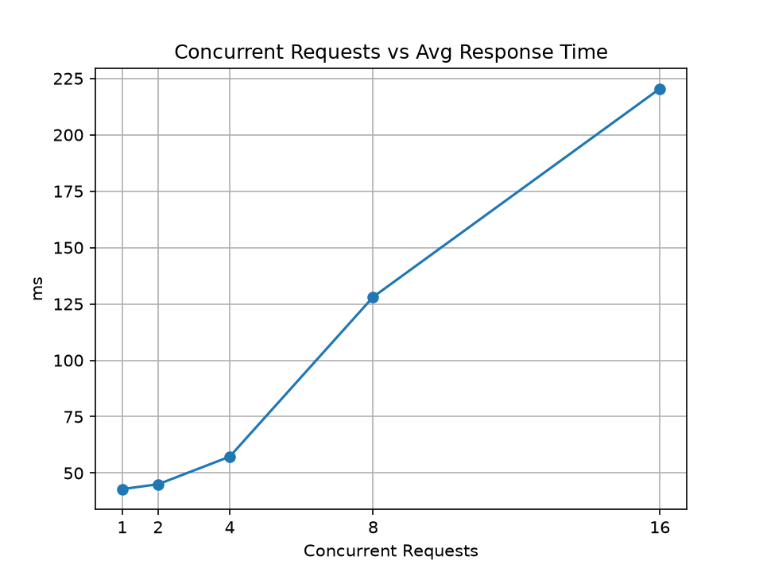
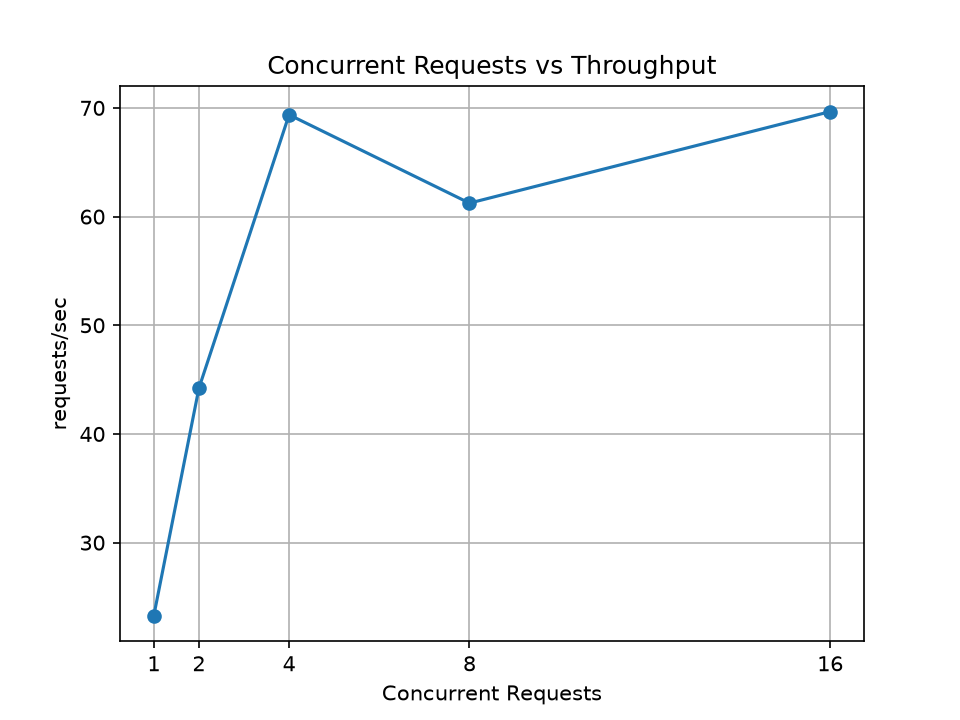
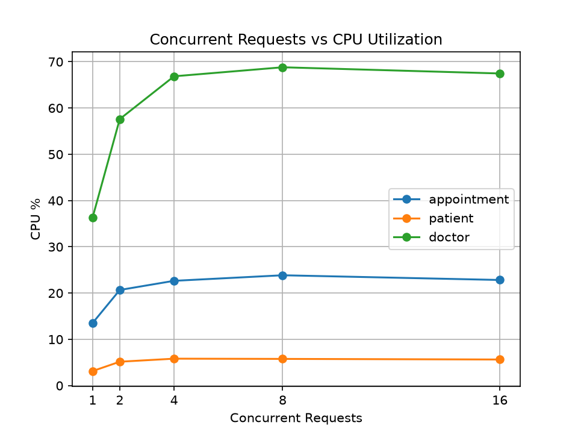
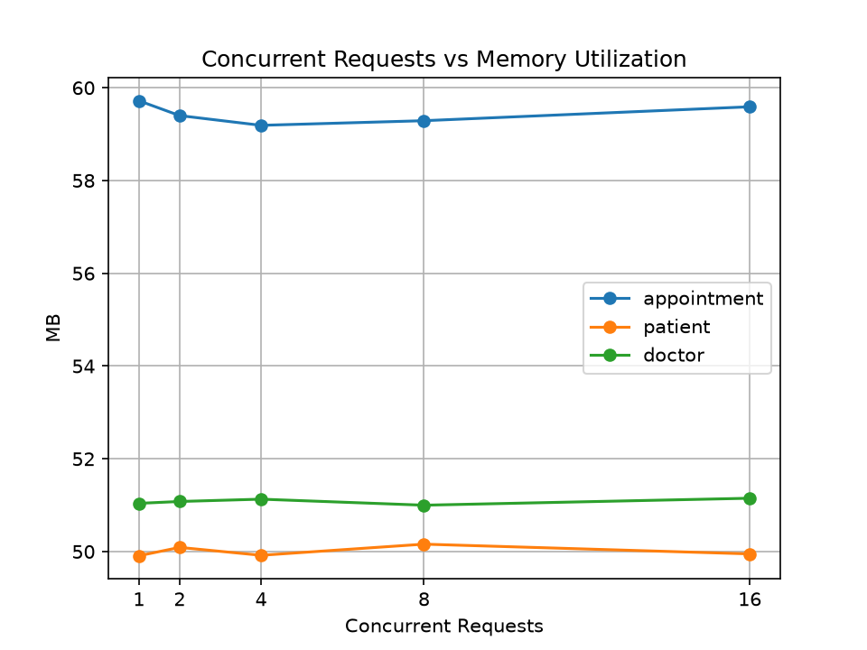

# Hospital Management - Containerized Microservice Application

**Experiment:** Build, Deploy and Analyze a Containerized Microservice Application Under Varying Workloads
**Domain:** Hospital Management
**Author:** vchaitrad

---

## 1. Aim
To develop a microservice-based application with three independent services, containerize and deploy them using Docker and Docker Compose, establish inter-service communication, generate varying workloads, monitor resource utilization, and analyze application performance.

## 2. Technologies Used
- Python 3.13 with Flask (REST APIs)
- Gunicorn (production server inside containers)
- Docker and Docker Compose
- Python `requests` and `threading` (load generator)
- `docker stats` (CPU and memory monitoring)
- Matplotlib (graphs)

## 3. Test Environment
- OS: Windows 11 with PowerShell
- Docker 29.8.0, Docker Compose v5.5.1, Python 3.13.15
- Docker Desktop: 12 CPUs, 7.6 GB memory

## 4. Architecture

    Client --> appointment-service (Service 1) --> patient-service (Service 2)
                                               --> doctor-service  (Service 3)

All three services run as separate containers on one Docker network (`hospital-net`). They call each other using Docker service names, not localhost.

## 5. Microservices

| Service | Port | Responsibility |
|---|---|---|
| appointment-service | 5000 | Entry point. Books an appointment by calling the patient and doctor services |
| patient-service | 5001 | Stores and returns patient records |
| doctor-service | 5002 | Stores and returns doctor records and availability (includes a small CPU loop to simulate availability checking) |

### 5.1 appointment-service (port 5000)
| Endpoint | Description |
|---|---|
| GET /health | Health check |
| GET /book/<patient_id>/<doctor_id> | Calls patient-service and doctor-service and returns a combined response |

### 5.2 patient-service (port 5001)
| Endpoint | Description |
|---|---|
| GET /health | Health check |
| GET /patients | List all patients |
| GET /patients/<id> | Get one patient (404 if not found) |

### 5.3 doctor-service (port 5002)
| Endpoint | Description |
|---|---|
| GET /health | Health check |
| GET /doctors | List all doctors |
| GET /doctors/<id> | Get one doctor (404 if not found) |

### 5.4 Example end-to-end response (GET /book/1/1)

    {
      "status": "appointment booked",
      "patient": {"id": 1, "name": "Ravi Kumar", "age": 34},
      "doctor": {"id": 1, "name": "Dr. Meena", "speciality": "Cardiology", "available": true}
    }

## 6. Project Structure

    hospital-project/
    |-- appointment-service/   (app.py, requirements.txt, Dockerfile)
    |-- patient-service/       (app.py, requirements.txt, Dockerfile)
    |-- doctor-service/        (app.py, requirements.txt, Dockerfile)
    |-- docker-compose.yml
    |-- load-test/             (loadtest.py, plot.py)
    |-- results/               (results.csv, 4 graph images)
    |-- screenshots/
    |-- analysis.txt
    |-- README.md

---

## 7. Checkpoint 1 - Design and Develop the Microservices
1. Domain selected: Hospital Management.
2. Three independent microservices identified: appointment, patient, doctor.
3. Responsibility of each service defined (see section 5).
4. Services implemented in Python using Flask.
5. REST API endpoints created for every service.
6. Each service was run and tested independently.
7. All APIs returned the expected responses.

Test the services locally (one terminal each):

    cd patient-service
    python app.py

## 8. Checkpoint 2 - Containerize and Deploy
1. A separate Dockerfile was created for each service.
2. Each service has its own `requirements.txt` (flask, gunicorn, and requests for appointment-service).
3. A Docker image was built for each service.
4. Images verified with `docker images`.
5. `docker-compose.yml` was created.
6. All three services are configured in Docker Compose.
7. The application is deployed with Docker Compose.
8. All three containers verified with `docker ps`.

Dockerfile used (the port differs per service):

    FROM python:3.11-slim
    WORKDIR /app
    COPY requirements.txt .
    RUN pip install --no-cache-dir -r requirements.txt
    COPY app.py .
    EXPOSE 5001
    CMD ["gunicorn", "-w", "2", "-b", "0.0.0.0:5001", "app:app"]

Commands:

    docker compose up --build -d
    docker images
    docker ps

## 9. Checkpoint 3 - Microservice Communication
1. The Docker network `hospital-net` is created through Docker Compose.
2. All three services are connected to the same network.
3. appointment-service reaches the others by service name:
   - `PATIENT_URL=http://patient-service:5001`
   - `DOCTOR_URL=http://doctor-service:5002`
4. Communication between services was tested.
5. An end-to-end request through all three services was performed.
6. The final combined response was returned to the client.

Commands:

    curl http://127.0.0.1:5000/book/1/1
    docker network ls
    docker compose logs patient-service

(PowerShell: `Invoke-RestMethod http://127.0.0.1:5000/book/1/1 | ConvertTo-Json -Depth 5`)

## 10. Checkpoint 4 - Workload Generation and Monitoring
1. API selected for testing: `GET /book/1/1` (touches all three services).
2. Load generator: custom Python script `load-test/loadtest.py` using a thread pool.
3. Five workload levels tested: 1, 2, 4, 8 and 16 concurrent requests.
4. Each level sends 200 requests (after 10 warm-up requests).
5. Average response time and throughput recorded for every level.
6. All three containers monitored using `docker stats`, sampled during every workload.
7. Average CPU and memory utilization recorded per container.
8. Successful and failed requests counted.

Run:

    pip install requests matplotlib
    python load-test/loadtest.py
    python load-test/plot.py

Results are saved to `results/results.csv`.

## 11. Checkpoint 5 - Results and Analysis

### 11.1 Observation Table (measured values)

| Workload | Concurrency | Avg Response Time (ms) | Throughput (req/s) | Failed |
|---|---|---|---|---|
| W1 | 1 | 42.90 | 23.29 | 0 |
| W2 | 2 | 45.03 | 44.21 | 0 |
| W3 | 4 | 57.29 | 69.37 | 0 |
| W4 | 8 | 128.08 | 61.24 | 0 |
| W5 | 16 | 220.45 | 69.66 | 0 |

### 11.2 CPU Utilization (%)

| Workload | Concurrency | appointment-service | patient-service | doctor-service |
|---|---|---|---|---|
| W1 | 1 | 13.53 | 3.14 | 36.35 |
| W2 | 2 | 20.67 | 5.16 | 57.61 |
| W3 | 4 | 22.65 | 5.82 | 66.86 |
| W4 | 8 | 23.85 | 5.77 | 68.81 |
| W5 | 16 | 22.83 | 5.64 | 67.47 |

### 11.3 Memory Utilization (MB)

| Workload | Concurrency | appointment-service | patient-service | doctor-service |
|---|---|---|---|---|
| W1 | 1 | 59.72 | 49.91 | 51.04 |
| W2 | 2 | 59.40 | 50.09 | 51.08 |
| W3 | 4 | 59.19 | 49.92 | 51.13 |
| W4 | 8 | 59.29 | 50.16 | 51.00 |
| W5 | 16 | 59.59 | 49.95 | 51.15 |

### 11.4 Graphs

**Concurrent Requests vs Average Response Time**

**Concurrent Requests vs Throughput**

**Concurrent Requests vs CPU Utilization**

**Concurrent Requests vs Memory Utilization**

### 11.5 Analysis
1. **Response time:** It was 42.90 ms at 1 concurrent request and 45.03 ms at 2. It rose to 57.29 ms at 4, then increased sharply to 128.08 ms at 8 and 220.45 ms at 16.
2. **Throughput:** It increased from 23.29 req/s at 1 request to 69.37 req/s at 4 requests. After that it stayed around 61-70 req/s, so the application saturated at about 4 concurrent requests.
3. **Failures:** There were 0 failed requests at all five levels. The application stayed stable but became slower.
4. **Resource usage:** doctor-service used the most CPU at every level (36.35% at 1 request, about 67-69% from 4 requests onward) because it performs the CPU-heavy availability check. appointment-service used moderate CPU (13.53% to 23.85%) and patient-service used the least (3.14% to 5.82%).
5. **Memory:** Memory stayed almost constant for all three containers (about 50-60 MB), so memory was not affected by the workload.
6. **Performance degradation:** Once doctor-service CPU reached its limit at about 4 concurrent requests, extra requests had to wait. Throughput stopped growing, so additional load only increased waiting time and response time.

### 11.6 Conclusion
Increasing the workload raises response time while throughput saturates. doctor-service is the bottleneck of this application. Memory usage is stable and no requests failed.

---

## 12. How to Run (for anyone cloning this repo)

    git clone https://github.com/vchaitrad/hospital-microservices.git
    cd hospital-microservices
    docker compose up --build -d
    docker ps
    curl http://127.0.0.1:5000/book/1/1

To stop everything:

    docker compose down

## 13. Final Deliverables Checklist
- [x] Source code of the three microservices
- [x] Three Dockerfiles
- [x] docker-compose.yml
- [x] Running Docker containers
- [x] Demonstration of inter-service communication
- [x] Workload test results (results/results.csv)
- [x] CPU and memory observations
- [x] Performance observation table
- [x] Performance graphs
- [x] Brief analysis and conclusion

## 14. Note
The measured values above come from the author's machine. Anyone running this should run `load-test/loadtest.py` on their own computer and use their own measured results.
